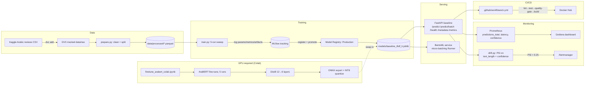

# arasent — Arabic E-Commerce Review Sentiment Analysis

**Final Project · Track 1 (Deep Learning) · MLOps Practitioner (ITI × MLOps MENA Community)**
Built by dentiligence, following the official rubric literally: an Arabic e-commerce review
gets classified as **negative / neutral / positive**, served through the same infrastructure
built across all 5 mini projects.

## Honesty clause (read this first)

This environment has **no GPU and no internet access** to HuggingFace Hub or Kaggle. So:

- **Everything below marked ✅ was actually run in this environment** — training, the API,
  Prometheus metrics, MLflow tracking + registry promotion, the DVC pipeline, ONNX export,
  the BentoML service, and a real Locust load test. Numbers in `reports/final-project.md`
  are real, not estimated.
- **AraBERT fine-tuning, distillation, and ONNX-INT8 quantization of AraBERT** need a GPU
  runtime and Hub access, so they're written as a complete, syntax-checked notebook
  (`notebooks/finetune_arabert_colab.ipynb`) meant to run on Colab/Kaggle. The baseline model
  (TF-IDF + Logistic Regression) exercises the *exact same interface* — `predict_one`,
  `predict_batch`, `save`, `load`, `model_version`, `framework` — so swapping in the real
  AraBERT checkpoint after running the notebook requires **zero code changes**, only
  `ARASENT_MODEL_BACKEND=transformer` (see `src/arasent/predict.py`).
- The Kaggle Arabic-reviews dataset itself wasn't downloadable here either — `data.py` falls
  back to a small synthetic-but-schema-faithful generator, same pattern as Mini Project 1's
  NYC-taxi fallback. Point `data/raw/arabic_reviews.csv` at the real dataset
  (https://www.kaggle.com/datasets/abedkhooli/arabic-100k-reviews or similar) for real numbers.

## Architecture



## Quickstart (3 commands)

```bash
pip install -e ".[dev]"
python -m arasent.train
uvicorn arasent.api.main:app --reload --port 8000
```

```bash
curl -X POST http://localhost:8000/predict \
  -H "Content-Type: application/json" \
  -d '{"text": "المنتج رائع جدا وسريع في التوصيل"}'
# {"label":"positive","confidence":0.95,...}
```

## Repository layout

```
src/arasent/
├── config.py             # settings incl. MLflow URI, PSI alert threshold, model backend
├── data.py                # Kaggle CSV loader + synthetic fallback + Arabic text cleaning
├── model.py                # SentimentClassifier — baseline (TF-IDF + LogisticRegression)
├── model_transformer.py    # ArabertSentimentClassifier — same interface, real AraBERT
├── train.py                 # 5-run MLflow sweep → registers + promotes to Production
├── prepare.py / evaluate.py # DVC pipeline stages
├── export.py                 # ONNX export + parity/latency check (baseline)
├── predict.py                 # backend-selectable loader (baseline vs transformer)
├── monitoring/drift.py         # PSI drift detection on text_length + confidence_score
└── api/                          # FastAPI: /health /metadata /predict /predict/batch /metrics
notebooks/finetune_arabert_colab.ipynb  # AraBERT fine-tune + distill + quantize (run on Colab)
serving/service.py                       # BentoML micro-batching service
loadtest/locustfile.py                    # realistic 80/15/5 traffic mix
pipelines/dvc.yaml                         # prepare → train → evaluate, DVC-tracked
.github/workflows/ci.yml                    # lint → test → quality-gate → build → push
monitoring/                                  # prometheus.yml, alerts.yml, Grafana dashboard
reports/final-project.md                      # rubric checklist + real measured numbers
```

## Rubric mapping (10-point scale)

| # | Area | Where |
|---|---|---|
| 1 | Code & packaging | `pyproject.toml`, `src/arasent/`, `SentimentClassifier`/`ArabertSentimentClassifier` |
| 2 | API endpoint | `api/main.py` — `/predict`, Pydantic validation, async handlers |
| 3 | Docker | `docker/Dockerfile` (multi-stage), `docker-compose.yml` |
| 4 | MLflow tracking | `train.py` — 5 runs, registered, promoted to Production ✅ verified |
| 5 | DVC data versioning | `pipelines/dvc.yaml` — `prepare→train→evaluate` ✅ `dvc repro` verified |
| 6 | CI/CD | `.github/workflows/ci.yml` — lint→test→quality-gate→build→push |
| 7 | Production serving | `serving/service.py` (BentoML) ✅ live-tested, `loadtest/locustfile.py` ✅ real run |
| 8 | Monitoring | `monitoring/drift.py` (PSI) ✅ tested, Prometheus `/metrics` ✅ verified, Grafana dashboard |
| 9 | Peer review | outside this repo — submit for review per the course process |
| 10 | README & architecture | this file |

Full numbers (MAE-equivalent metrics, latency tables, DVC metrics, Locust results) are in
`reports/final-project.md`.
