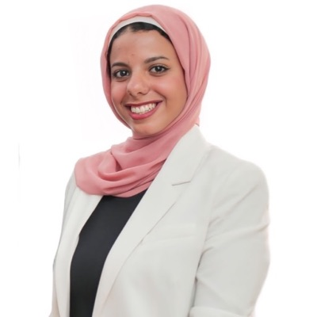
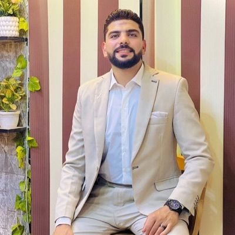
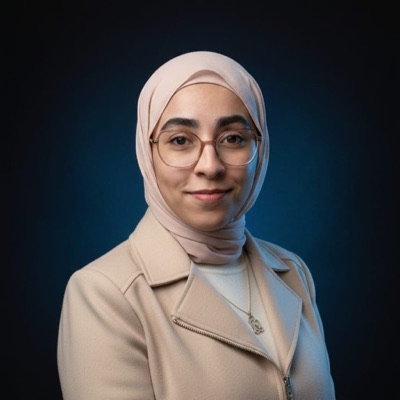
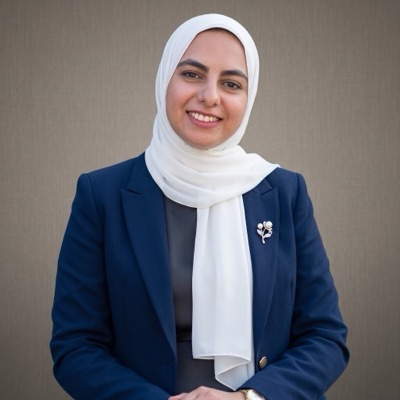

# The MLOps Practitioner : Course Notes
> Cohort 1 · Aug 15 → Oct 2, 2026 · 7 weeks · 5 live lessons · Free
just hosting my brain dump for The MLOps Practitioner course by MLOps MENA.cohort 1 / aug 15 – oct 2, 2026 / 7 weeks of pure suffering (jk) / 5 live sessions / cost: $0 absolute steal fr
  
---
## what is this even about

basically, you stop copy-pasting code in messy notebooks and actually put models into production. you're gonna build automated ci/cd pipelines, track experiments so you don't lose your mind, and set up automatic retraining.
we're serving predictions at scale using **FastAPI, BentoML, Triton, and vLLM**, catching data drift before users can even complain, and optimizing everything for gpu, cpu, and edge.

## the state 

| | |
|---|---|
| **Lessons** | 5 live sessions |
| **Duration** | 7 weeks |
| **Dates** | Aug 15 → Oct 2, 2026 |
| **Price** | literally $0 |
| **Rating** | 4.9 (7 reviews, valid fr) |
| **Delivered with** | Zomra (the edu partner) |
| **Instructor** | Aya Nasser Salama = Founder of MLOps MENA & Senior MLOps Engineer |

---

## the 7 things you're actually gonna learn

1. stop writing spaghetti code. you'll structure ml projects like a pro using python packages, oop, and type hints, then build productionREST APIs with **FastAPI**/**Litestar** (all packaged in docker and tested with pytest so it doesn't crash).
2. track your experiments and version your data with **MLflow** and **DVC** so you don't lose your work. plus, automate the whole train → test → build → push flow using **GitHub Actions** and **Terraform** because doing it manually is a waste of time.
3.set up continuous training pipelines that automatically retrain and update your models the second data drifts or performance drops. zero human intervention needed.
4. stop guessing how to deploy. learn to serve models using the actual full stack: **FastAPI → BentoML → TensorRT/Triton (GPU) → ONNX Runtime/OpenVINO (CPU) → vLLM (for LLMs)**.
5. ship updates without breaking stuff. use safe rollout methods like canary, a/b testing, blue/green, and shadow mode—with automatic rollbacks if things go sideways.
6. catch data, concept, or embedding drift using math checks (PSI, KS test, MMD) before anyone notices, and spy on your system with **Prometheus, Grafana, Langfuse, and RAGAS**.
7. make your models run fast. optimize them using pruning, quantization (PTQ/QAT), and knowledge distillation via TensorRT, OpenVINO, and TFLite while balancing accuracy vs. speed.
## the stack (tools you'll use)

`FastAPI` `Litestar` `Docker` `pytest` `MLflow` `DVC` `GitHub Actions` `Terraform` `Apache Airflow` `BentoML` `Triton` `vLLM` `TensorRT` `ONNX Runtime` `OpenVINO` `TFLite` `Evidently AI` `Prometheus` `Grafana` `Langfuse` `RAGAS`

**what you need before starting:** basic Python (functions, classes, pandas, scikit-learn) · must have trained at least one random ml model before · a laptop with Docker and at least 8GB RAM (don't fry your pc).

---

## the weekly breakdown

<b>Week 1 · Aug 15 – Aug 21 — escaping jupyter notebooks</b>

the mlops maturity model · structuring projects properly & python packaging · building ml apis (fastapi vs litestar) · serialization formats · dockerizing everything · structured logging · writing tests with pytest so it doesn't break

**Week 1 project** — a fully dockerized ml api with actual tests, proper logs, and a super short 3-command readme.
> recording is up

<b>Week 2 · Aug 22 – Aug 28 — tracking, versioning & automation</b>

mlflow for experiment tracking · mlflow model registry · continuous training with mlflow · data versioning with dvc · ci/cd pipelines with github actions · setting up infra with terraform

**Week 2 project** — a completely automated github actions pipeline that trains a model, tests it against what's already live, promotes it only if it's actually better, and builds the docker image. everything is tracked in mlflow and dvc.
> recording is up

<b>Week 3 · Aug 29 – Sep 4 — mid-term project catch-up</b>

no live class this week. just pure building, working on your project, and fixing up everything from the first two weeks.

<b>Week 4 · Sep 5 – Sep 11 — serving models & shipping updates</b>

orchestration with apache airflow · why inference patterns matter · the 3 major inference setups · what model serving actually looks like · cat 1: fastapi · cat 2: bentoml · cat 3: tensorrt + triton · cat 4: onnx runtime + openvino · cat 5: vllm · load testing using locust · how to release updates without breaking production

**Week 4 project** — serve the ride-duration model 3 different ways, spam it with 100 concurrent users to find where it chokes, and deploy a new version via canary rollout that automatically rolls back if it breaks.
> recording is up

<b>Week 5 · Sep 12 – Sep 18 — making models fast, tiny, and cheap (up next)</b>

why model optimization matters · pruning · post-training quantization · quantization-aware training · knowledge distillation · tensorrt · onnx runtime · openvino · edge deployment · llm quantization (awq, gptq) · benchmarking and deciding when to optimize

> live session: Sunday 13 Sept, 7:00 pm Cairo time

<b>Week 6 · Sep 19 – Sep 25 — monitoring & catchin' drift</b>

why models go bad in production · types of data drift · statistical tests to catch drift · evidently ai · page-hinkley & adwin · label and prediction drift · embedding drift · setting up prometheus + grafana · langfuse · ragas · tracking costs & tokens · adding guardrails

> live session: Sunday 20 Sept, 7:00 pm Cairo time

<b>Week 7 · Sep 26 – Oct 2 — the final boss (capstone project)</b>

ship the whole project end-to-end, demo it to the community, and get your repo reviewed by professionals.

---

## study groups (pick by your actual skills, don't just flex your job title)

| group | name | who it's for |
|---|---|---|
| 1 | MLOps Beginner | junior in ml/ds, comfy with python & basic ml, but completely new to linux/git/docker |
| 2 | MLOps Intermediate | backend/software engineering background, already working with fastapi/flask, solid with git & docker |
| 3 | Advanced MLOps / Cloud | hands-on cloud experience (aws/gcp/azure), know your way around kubernetes, terraform, and monitoring |
| 4 | DevOps → MLOps | currently doing devops/platform/sre, strong ops skills, just need to figure out the ml side of things |

---

## 👤 The Team

<table>
<tr>
<td align="center" width="200">
 
<b>Aya Nasser Salama</b> 
Founder
</td>
<td align="center" width="200">
 
<b>Basem Abusaif</b> 
Community Director
</td>
<td align="center" width="200">
 
<b>Omar Salah</b> 
Community Director
</td>
</tr>
<tr>
<td align="center">
 
<b>Mohamed Samy Mansour</b> 
AI Instructor Lead
</td>
<td align="center">
<b>ZA</b> 
<b>Zakaria Ahmed</b> 
AI Content Lead
</td>
<td align="center">
 
<b>Radwa Khattab</b> 
AI Community Growth & Partnerships Lead
</td>
</tr>
<tr>
<td align="center">
 
<b>Mariam Qotob</b> 
AI Sessions & Mentorship Lead
</td>
<td align="center">
 
<b>Mahmoud Abu Al-Nour</b> 
AI Platform & Social Media Lead
</td>
<td align="center">
<b>?</b> 
<b>Khadija Ahaidous</b> 
AI Research Lead
</td>
</tr>
</table>

### the crew running the show

<b>Aya Nasser Salama</b> — Founder & Instructor 

* **who:** Senior MLOps & LLMOps Engineer with 6+ years in AI. 
* **what she does:** the central MLOps/LLMOps brain at Unifonic (handling agentic products with LangGraph/MCP, LLM observability, and serving 30B+ models on Kubernetes). 
* **flexes:** designed and teaches "Production ML Engineering" at ITI, and built Valeo's first production RAG system.
* **links:** [LinkedIn](#) · `aya@mlopsmena.com`

<b>Basem Abusaif</b> — Community Director 

* **who:** AI Engineer working on 3D perception and generative AI with 5+ years building deep learning pipelines.
* **what he does:** leads the 3D perception stack at Wakeb Data, previously productionised LiDAR simulation models at Valeo.
* **flexes:** currently finishing up an MSc in Informatics at Nile University.
* **contact:** `basem@mlopsmena.com`

<b>Omar Salah</b> — Community Director 

* **what he does:** co-runs the community day-to-day. he's the reason sessions happen, study groups run smoothly, and the program actually moves forward.
* **contact:** `omar@mlopsmena.com`

<b>Mohamed Samy Mansour</b> — AI Instructor Lead 

* **who:** AI and Data Science engineer (Computer Engineering grad from Mansoura University).
* **what he does:** Mid-Level Data Scientist at Andalusia Healthcare Group, previously at Etisalat Misr, working across ML pipelines, model serving, and LLM/RAG apps.
* **contact:** `mohamedsamy@mlopsmena.com`

<b>Zakaria Ahmed</b> — AI Content Lead 

* **what he does:** owns the community's written content. if you're reading a roadmap, article, or session material, he's the one who wrote it.
* **contact:** `zakaria@mlopsmena.com`

<b>Khadija Ahaidous</b> — AI Research Lead 🔬

* **what she does:** leads the community's research direction, curates the papers you read, handles published work, and takes care of academic mentoring.
* **contact:** `khadijaahaidous@mlopsmena.com`

<b>Radwa Khattab</b> — AI Community Growth & Partnerships Lead 

* **who:** Senior AI Engineer with 6+ years of experience, including 2 years at Microsoft as an Applied & Data Scientist.
* **what she does:** builds production AI/ML systems across LLMs, agentic AI, and cloud infra.
* **flexes:** doing a Master's in AI at Cairo University and has taught AI/ML at two universities plus Udacity.
* **contact:** `radwa@mlopsmena.com`

<b>Mariam Qotob</b> — AI Sessions & Mentorship Lead 

* **who:** AI/ML engineer with a professional master's in AI from Queen's University.
* **what she does:** works across the full ML pipeline with hands-on experience in LLMs and RAG. currently a TA for the Digilians Initiative.
* **contact:** `mariam@mlopsmena.com`

<b>Mahmoud Abu Al-Nour</b> — AI Platform & Social Media Lead 📱

* **who:** Computer Science student completely focused on AI, Machine Learning, and Data Science.
* **what he does:** builds practical AI solutions using Python, SQL, FastAPI, Docker, and MLOps tooling.
* **contact:** `mahmoud@mlopsmena.com`

---

## My SelfStudy Learn

> _(Personal section — update as I go through each week)_

- [x] Week 1 — From Notebook to Production-Ready Code
- [x] Week 2 — MLOps Core
- [x] Week 3 — Project (1st half)
- [x] Week 4 — Inference, Serving & Release Strategies
- [x] Week 5 — Model Optimization *(upcoming: Sun 13 Sept, 7pm Cairo)*
- [ ] Week 6 — Observability & Drift Detection
- [ ] Week 7 — Final Project

## faq (frequently asked questions fr)

**is it normal to feel completely lost as a junior/student with all these terms?**
yes, 100%. it just means the session is doing what it’s supposed to do. feeling totally overwhelmed is a side effect of finally leaving your jupyter notebook behind and realizing how massive the field actually is. 

**how do i deal with all this new terminology?**
just write down every new word you hear. look it up on youtube, skim the official docs, and if it still doesn't make sense, just ask the community.

**will the recordings stay up?**
session 1 stays permanently on youtube. the rest are taken down 48 hours after each session finishes, so don't sleep on them.

