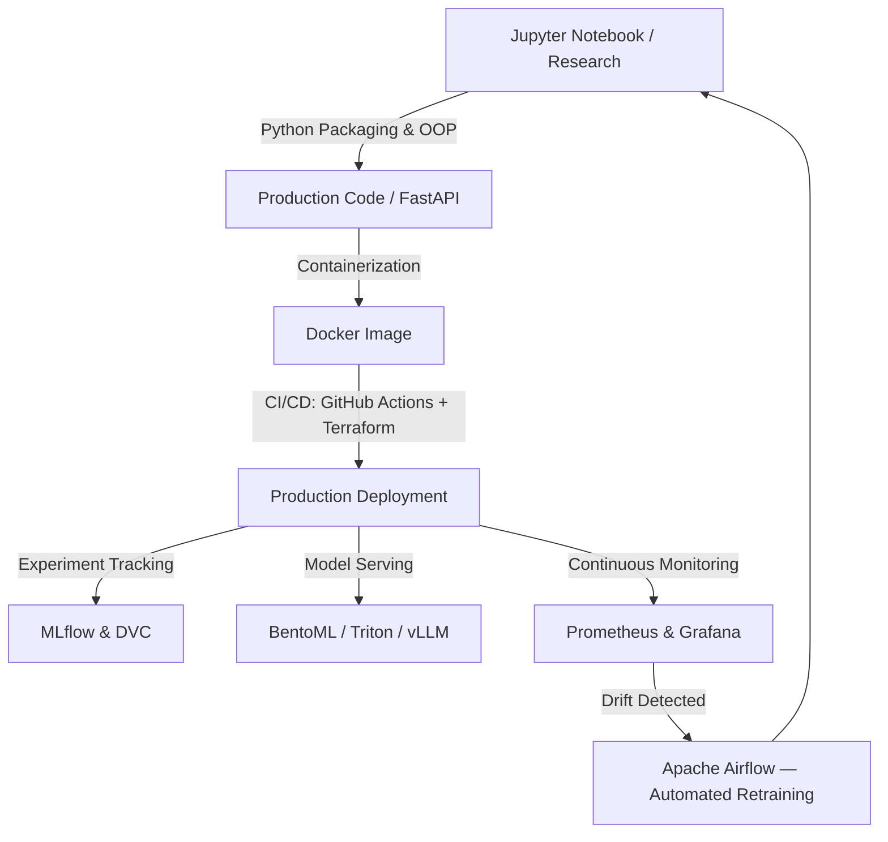

<div align="center">

# The MLOps Practitioner

### Course Artifacts & Reference Implementation

<p>
  
  
</p>
<p>
  
  
  
  
  
</p>

*Taking machine learning models from research notebooks to automated, monitored, self-healing production infrastructure.*

[Architecture](#-system-architecture--workflow) ·
[Repository Structure](#-repository-structure) ·
[Tech Stack](#-core-technology-stack--infrastructure) ·
[Quick Start](#-quick-start--replication) ·
[Curriculum](#-curriculum-roadmap) ·
[Course Logistics](#-course-logistics) ·
[Capstone Tracks](#-capstone-project-tracks)

</div>

---

## Overview

This repository contains the reference implementations, production-grade architectures, and core
engineering modules completed during **The MLOps Practitioner**, a free community curriculum
delivered by **MLOps MENA Community** (powered by **Zomra**) and instructed by **Aya Nasser
Salama**, Senior MLOps Engineer and Founder of MLOps MENA Community.

The program's objective: transition a model from a Jupyter notebook to a packaged, tested,
containerized, tracked, served, optimized, and observed production system — the full lifecycle,
not just the training step.

---

## 🏗️ System Architecture & Workflow



---

## 📂 Repository Structure

```text
├── .github/workflows/    # CI/CD pipelines (GitHub Actions)
├── config/                # Infrastructure config (Terraform, Docker Compose)
├── data/                  # DVC pointers — raw data never committed directly
├── models/                # Saved artifacts, tracked via MLflow
├── src/
│   ├── api/                # REST layer (FastAPI / Litestar)
│   ├── training/           # Continuous training pipelines
│   └── utils/               # Shared types, config, helpers
├── tests/                 # pytest — unit + integration, coverage-gated
├── Dockerfile             # Multi-stage, non-root runtime
└── README.md
```

---

## 🛠️ Core Technology Stack & Infrastructure

| Layer | Tools |
|---|---|
| **Software engineering** | OOP, type hints, Python packaging, `pytest` |
| **Inference & serving** | FastAPI, Litestar, BentoML, TensorRT/Triton (GPU), ONNX Runtime/OpenVINO (CPU), vLLM (LLMs) |
| **Lifecycle & data versioning** | MLflow, DVC |
| **Automation & IaC** | GitHub Actions, Terraform, Apache Airflow |
| **Deployment patterns** | Canary rollout, A/B testing, blue/green, shadow mode |
| **Observability** | Prometheus, Grafana, Langfuse, RAGAS, Evidently AI |
| **Edge & hardware optimization** | Pruning, PTQ/QAT quantization, knowledge distillation, TFLite |

---

## 🚀 Quick Start & Replication

```bash
# 1. Clone
git clone https://github.com/<your-org>/mlops-practitioner-zomra.git
cd mlops-practitioner-zomra

# 2. Build and run the orchestrated environment
docker build -t mlops-production-api .
docker compose up -d
```

| Service | Endpoint |
|---|---|
| FastAPI docs | `http://localhost:8000/docs` |
| MLflow dashboard | `http://localhost:5000` |
| Grafana | `http://localhost:3000` |

---

## 📅 Curriculum Roadmap

| Module | Focus |
|---|---|
| **1 — Notebook → Production** | Packaging notebooks into modular Python, `pytest`, a containerized FastAPI REST API |
| **2 — MLOps Core** | Experiment tracking (MLflow) and data versioning (DVC) |
| **3 — Mid-Project Checkpoint** | Halfway build review, pipeline testing, structured code review |
| **4 — Inference, Serving & Release** | Canary rollouts, A/B testing, shadow mode |
| **5 — Model Optimization** | Pruning, PTQ/QAT quantization, latency-vs-accuracy tradeoffs |
| **6 — Observability & Drift** | Runtime monitoring; catching data, concept, and embedding drift |
| **7 — Capstone** | A fully automated, scalable, end-to-end production pipeline |

---

## 🎓 Capstone Project Tracks

Two tracks, equal difficulty, same 10-point rubric. Pick one, peer-review the other.

| Track | Domain |
|---|---|
| **1 — Deep Learning** | Arabic sentiment analysis on e-commerce product reviews |
| **2 — LLM / RAG** | Arabic legal document Q&A — Egyptian Civil Code, ~1,200 articles |

### Capstone rubric (10 criteria)

1. Correctly packaged code (OOP, type hints, `pyproject.toml`)
2. Dockerfile → image → container
3. API endpoint with input validation
4. MLflow experiment tracking
5. Data versioning with DVC
6. CI/CD pipeline (GitHub Actions)
7. Git branches, pull requests, merge discipline
8. Production serving + monitoring
9. Completed peer review of another submission
10. README + architecture diagram

---

## 📋 Course Logistics

| | |
|---|---|
| **Start date** | Sunday, August 16 |
| **Duration** | 5 sessions, Weeks 1, 2, 4, 5, 6 (Sundays) |
| **Week 3** | Off — dedicated build time for the capstone |
| **Session time** | 7:00–10:00 PM (3 hours) |
| **Format** | Live on YouTube (800+ concurrent viewers) |
| **End date** | September 20 |
| **Cost** | Free (one-time cohort) |

**Weeks 1–2:** folder structure, scripts vs. notebooks · MLflow tracking & registry · DVC ·
CI/CD basics · Terraform basics · optional mini projects.

**Weeks 4–6:** batch/streaming inference · serving (MLflow, Ray Serve, KServe) · GPU/CPU
acceleration · load testing · quantization/TensorRT · LLM RAG, cost monitoring, guardrails, drift.

**Attendance is tracked** via a one-minute feedback form plus a session keyword, submitted after
each session. Two certificates are available: an **attendance certificate** (5/5 sessions + 5
feedback forms) and a **project certificate** (capstone submission + peer review of another
student's project + written feedback).

**Prerequisites:** Andrew Ng's Supervised Learning course (Coursera), plus hands-on practice
comparing Linear/Logistic Regression, Random Forest and XGBoost across at least one dataset.
Write your own code and understand every line — this course is intentionally not
AI-assisted-authorship for submissions.

**Working strategy:** start building in Week 3 (after the first two sessions) → one GitHub repo →
one branch per concept → pull request with CI/CD attached → final review against the rubric
checklist.

---

## Credits

*Instructed by Senior MLOps Engineer **Aya Nasser Salama**, Founder of MLOps MENA Community.*
*Delivered in partnership with **Zomra**.*
