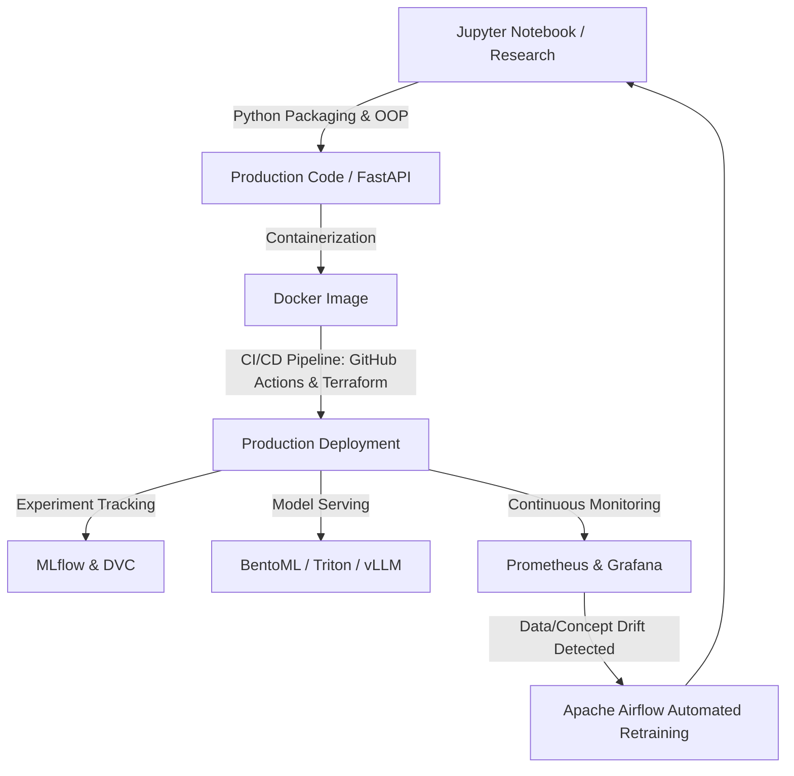

# MLOps Practitioner Course Artifacts

[](https://zomra.io)
[](https://zomra.io)
[](https://python.org)
[](https://docker.com)

This repository contains the official reference implementations, production-grade architectures, and core engineering modules completed during **The MLOps Practitioner** curriculum, powered by **Zomra** and **MLOps MENA Community**. 

The primary objective of this program is to transition machine learning models from experimental research environments (Jupyter Notebooks) to automated, monitored, and self-healing production infrastructure.

---

## 🏗️ System Architecture & Workflow

The production pipeline integrates continuous integration, automated deployment, and active monitoring models as illustrated below:



---

## 📂 Repository Structure

The project follows standard monolithic engineering layouts for decoupled ML systems:

```text
├── .github/workflows/   # CI/CD pipelines (GitHub Actions)
├── config/              # Infrastructure Configuration (Terraform, Docker Compose)
├── data/                # Data versioning tracking files (DVC pointers)
├── models/              # Saved models & artifacts (MLflow tracking)
├── src/                 # Production-grade source code
│   ├── api/             # REST APIs (FastAPI / Litestar)
│   ├── training/        # Continuous Training pipelines
│   └── utils/           # Type hints & Helper classes
├── tests/               # Unit & Integration tests (Pytest)
├── Dockerfile           # Environment containerization
└── README.md            # Reference documentation
```

---

## 🛠️ Core Technology Stack & Infrastructure

* **Software Engineering:** Object-Oriented Programming (OOP), Type Hints, Python Packaging, `pytest`
* **Model Inference & Serving Stack:** FastAPI, Litestar, BentoML, TensorRT/Triton (GPU), ONNX Runtime/OpenVINO (CPU), vLLM (LLMs)
* **Lifecycle & Data Versioning:** MLflow, DVC (Data Version Control)
* **Automation & Infrastructure-as-Code (IaC):** GitHub Actions, Terraform, Apache Airflow
* **Deployment Patterns:** Canary Rollouts, A/B Testing, Blue/Green Deployments, Shadow Mode
* **Observability & Drift Detection:** Prometheus, Grafana, Langfuse, RAGAS, Evidently AI
* **Edge & Hardware Optimization:** Pruning, Quantization (PTQ & QAT), Knowledge Distillation, TFLite

---

## 🚀 Quick Start & Replication

Execute the following commands to clone the workspace and replicate the containerized microservices locally:

```bash
# 1. Clone the repository
git clone https://github.com
cd mlops-practitioner-zomra

# 2. Build and run the orchestrated container environment
docker build -t mlops-production-api .
docker-compose up -d
```

### Infrastructure Endpoints
* **FastAPI Docs Server:** `http://localhost:8000/docs`
* **MLflow Central Dashboard:** `http://localhost:5000`
* **Grafana Telemetry Matrix:** `http://localhost:3000`

---

## 📅 Curriculum Roadmap

### 🔹 Module 1: From Notebook to Production-Ready Code
* Engineering modular python packages from raw notebooks, testing code via `pytest`, and creating containerized REST APIs via FastAPI.

### 🔹 Module 2: MLOps Core — Experiment Tracking, Versioning & Automation
* Standardizing data tracking using DVC and tracking model experiments using MLflow.

### 🔹 Module 3: Mid-Project Implementation & Core Architecture Revision
* Halfway application development, pipeline testing, and systematic code reviews.

### 🔹 Module 4: Inference, Serving & Release Strategies
* Production deployment strategies using canary rollouts, A/B testing, and shadow modes.

### 🔹 Module 5: Model Optimization
* Model pruning, Quantization (PTQ and QAT), and measuring latency vs. accuracy tradeoffs.

### 🔹 Module 6: Observability & Drift Detection
* Monitoring production runtime and catching concept, data, and embedding drift.

### 🔹 Module 7: End-to-End Capstone Project
* Constructing and deploying a fully automated, scalable production pipeline.

---
*Course Instructed by Senior MLOps Engineer **Aya Nasser Salama**, Founder of MLOps MENA Community.*
